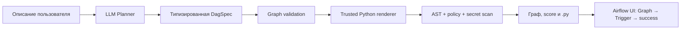

# DAG Forge

Безопасный AI-assisted генератор Python DAG-файлов для Apache Airflow 3 с собственным web UI,
графом зависимостей и статической проверкой результата.


## Идея проекта

Прямая генерация Python большой языковой моделью плохо контролируется: модель может выдумать
импорт, вставить секрет, создать цикл или использовать устаревший Airflow API. DAG Forge делит
процесс на безопасные этапы:



LLM отвечает только за смысловой план. Python формируется детерминированным renderer-ом, а
Pydantic не пропускает неизвестные зависимости, повторяющиеся ID и циклы.

## Возможности

- генерация DAG по русскому или английскому описанию;
- выбор источника, назначения, Airflow Connection IDs и cron;
- policy packs `basic`, `production`, `strict`;
- локальный Ollama с JSON Schema Structured Outputs;
- OpenAI Structured Outputs через Responses API;
- автономный demo mode без API-ключа;
- граф зависимостей в браузере;
- проверка синтаксиса Python через AST;
- поиск hardcoded secrets, опасных вызовов и Airflow anti-patterns;
- публикация проверенного DAG одной кнопкой в локальный Airflow UI;
- штатные Airflow Graph/Grid/Code views и ручной Trigger;
- интеграционный smoke test через настоящий Apache Airflow 3.3;
- score качества, JSON-спецификация, копирование и скачивание `.py`;
- REST API, Swagger UI, CLI, Docker и тесты.

## Полный запуск демонстрации в WSL

### Требования

- Python 3.12;
- Docker Desktop с включённой WSL integration;
- Ollama и загруженная модель `qwen3:4b`;

### Подготовка к запуску

```bash
python3.12 -m venv .venv
source .venv/bin/activate
python -m pip install -e ".[dev]"
test -f .env || cp .env.example .env

ollama pull qwen3:4b
```


### Запуск

Терминал 1 — локальный Apache Airflow:

```bash
make airflow-demo
docker compose --profile airflow-demo ps
```


Терминал 2 — Ollama:

```bash
source ~/.profile
ollama serve
```

Терминал 3 — DAG Forge:

```bash
source .venv/bin/activate
dagforge serve --host 127.0.0.1 --port 8000
```

Откройте:

- DAG Forge: [http://localhost:8000](http://localhost:8000);
- Airflow UI: [http://localhost:8080](http://localhost:8080);
- Swagger: [http://localhost:8000/docs](http://localhost:8000/docs).

Проверка backend:

```bash
curl -fsS http://127.0.0.1:8000/api/health
```

Ожидаемый режим — `ollama`, модель — `qwen3:4b`.

### Порядок действий

1. Заполните форму DAG Forge и нажмите «Сгенерировать DAG».
2. Покажите вкладки «Граф», «Python», «Проверки» и `JSON Spec`.
3. Во вкладке «Python» нажмите `Открыть в Airflow`.
4. Airflow DAG processor подхватит новый `.py` из общей папки `generated/`.
5. В Airflow откройте `Dags`, найдите тот же `dag_id` и перейдите в `Graph`.
6. Нажмите `Trigger` и дождитесь зелёного состояния `success`.

Если DAG ещё не виден, подождите 5–10 секунд и обновите список. Новый DAG публикуется активным,
поэтому отдельно снимать его с паузы не требуется.

### Остановка

Остановите DAG Forge и Ollama через `Ctrl+C`, затем остановите Airflow:

```bash
cd /home/medit3rranean/code/hse-de-practise
make airflow-demo-stop
```

Проверка, что контейнеры остановлены:

```bash
docker compose --profile airflow-demo --profile airflow-test ps --all
```

### Автоматическая проверка в Airflow

Отдельный одноразовый integration test рендерит стабильный DAG, загружает его через `DagBag`,
проверяет задачи и зависимости, а затем выполняет граф командой `airflow dags test`:

```bash
make airflow-check
```

Успешное завершение:

```text
DAGBAG_OK dag_id=dagforge_airflow_smoke tasks=3 edges=2
AIRFLOW_SMOKE_OK dag_id=dagforge_airflow_smoke
```

`airflow-check` — автоматический smoke test без UI. Для записи защиты используйте
`make airflow-demo` и показывайте штатные Graph View, Trigger и DagRun `success`.

## AI-провайдеры

Провайдер выбирается переменной `AI_PROVIDER`: `ollama`, `openai`, `demo` или `auto`. Режим
`auto` предпочитает OpenAI при наличии ключа, затем Ollama при заданной локальной модели, иначе
включает детерминированный Demo.

### Бесплатная локальная модель Ollama

Установите Ollama в той же WSL-среде, запустите
сервер и один раз загрузите модель:

```bash
ollama serve
# В другом терминале:
ollama pull qwen3:4b
```


## CLI

```bash
dagforge generate \
  --prompt "Каждое утро получать заказы из API и загружать их в PostgreSQL" \
  --source rest_api \
  --destination postgresql \
  --schedule "0 6 * * *" \
  --output generated/orders_dag.py
```

## API

| Метод | Путь | Назначение |
|---|---|---|
| `GET` | `/api/health` | режим, версия и готовность |
| `GET` | `/api/examples` | примеры для UI |
| `POST` | `/api/generate` | план, Python и validation report |
| `POST` | `/api/airflow/publish` | безопасный рендеринг `DagSpec` в папку Airflow |
| `POST` | `/api/validate` | статическая проверка произвольного DAG |

## Структура

```text
src/dagforge/
├── api.py          # FastAPI endpoints и web UI
├── planner.py      # Ollama, OpenAI и deterministic planners
├── models.py       # DagSpec, graph invariants и API schemas
├── renderer.py     # доверенная генерация Airflow Python
├── validator.py    # AST, security и production rules
├── service.py      # orchestration use case
└── static/         # интерфейс без Node.js build step
```

## Проверки

```bash
make test
make lint
make airflow-check
```

Тесты покрывают графовые инварианты, feature toggles, renderer, injection isolation,
статические security rules и API. Отдельный `make airflow-check` проверяет импорт и выполнение
сгенерированного DAG в Apache Airflow 3.3.
